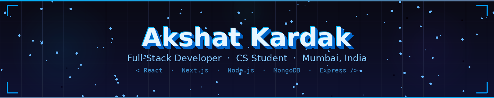
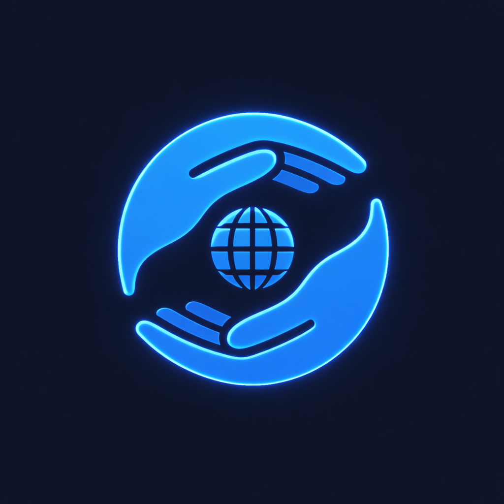
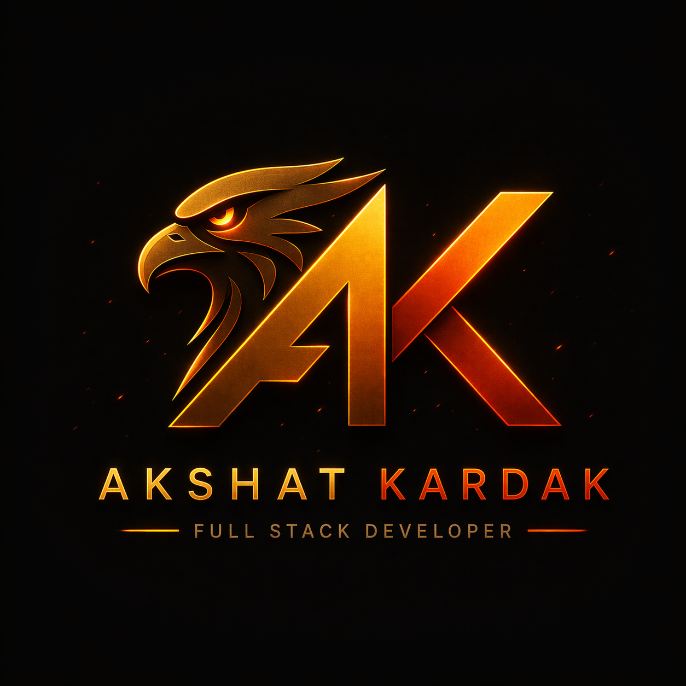

<div align="center">



</div>

<div align="center">


<br/>

<p>
  <a href="https://www.linkedin.com/in/akshatkardak/"></a>
  <a href="mailto:kardakakshat@gmail.com"></a>
  <a href="https://github.com/AkshatKardak"></a>
  
</p>

</div>

---

## 👨‍💻 About Me


I'm a Computer Science student from Mumbai who got hooked on building things the moment I wrote my first `console.log`. Since then, I haven't really stopped.

I've shipped full-stack products — a real NGO donation platform, an AI tweet generator, a car rental system with a Gemini-powered chat assistant — and each one taught me more than any tutorial ever could. I work across the whole stack: React and Next.js on the front, Node.js and Express on the back, MongoDB for data, and whatever tool the problem demands.

Right now I'm interning, building, learning Socket.io and Three.js on the side, and genuinely enjoying every bit of it. I believe the best developers aren't the ones who know everything — they're the ones who figure things out fast and ship anyway.

When I'm not at my desk, I'm on the cricket field or two hours deep into a game I told myself I'd play for twenty minutes. 🏏🎮

> *"Ship it. Learn from it. Build something better."*

---

## 💼 Experience

<table>
  <tr>
    <td width="50%" valign="top">
      <h3>🏢 Web Development Intern</h3>
      <strong>Employment Express Verband LLP</strong><br/>
      <em>Aug 2025 – Oct 2025 · 3 months</em>
      <br/><br/>
      
      
      
      <br/><br/>
      <ul>
        <li>Built & maintained web interfaces using React.js with focus on clean UI and solid functionality</li>
        <li>Shipped features end-to-end in real client-facing projects within a professional team</li>
        <li>First industry exposure — delivered in a structured professional dev environment</li>
      </ul>
    </td>
    <td width="50%" valign="top">
      <h3>📣 Publicity Team Member</h3>
      <strong>Computer Society of India — DMCE Chapter</strong><br/>
      <em>Aug 2024 – Apr 2025 · 9 months</em>
      <br/><br/>
      
      
      
      <br/><br/>
      <ul>
        <li>Handled event promotion, social media coordination & outreach for college tech events</li>
        <li>Organized college-level tech activities and community initiatives</li>
        <li>Helped grow the college tech community through consistent publicity work</li>
      </ul>
    </td>
  </tr>
</table>

---

## 🚀 Featured Projects

<table>
  <tr>
    <td width="50%" valign="top" align="center">
      <a href="https://rentridefrontend.vercel.app/">
        
      </a>
      <br/><br/>
      <strong>RentRide – AI Car Rental</strong>
      <br/><br/>
      <p align="left">Full-stack MERN car rental platform with <strong>Gemini AI chat assistant</strong>, admin dashboard, damage report system & Razorpay payments.</p>
      <p align="left">
        
        
        
        
      </p>
      <a href="https://github.com/AkshatKardak/RentRide"></a>
      <a href="https://rentridefrontend.vercel.app/"></a>
    </td>
    <td width="50%" valign="top" align="center">
      <a href="https://roasthubfront.vercel.app/">
        
      </a>
      <br/><br/>
      <strong>RoastHub – AI Tweet Generator</strong>
      <br/><br/>
      <p align="left">AI-powered savage tweet generator with authentic Indian flavor — Bollywood refs, cricket banter & desi slang. Powered by <strong>Groq API</strong>.</p>
      <p align="left">
        
        
        
        
      </p>
      <a href="https://github.com/AkshatKardak/RoastHub"></a>
      <a href="https://roasthubfront.vercel.app/"></a>
    </td>
  </tr>
  <tr>
    <td width="50%" valign="top" align="center">
      <a href="https://unitedimpact-app.netlify.app/">
        
      </a>
      <br/><br/>
      <strong>UnitedImpact – NGO & Donor Platform</strong>
      <br/><br/>
      <p align="left">MERN NGO platform with real-time geo-mapping, live campaign tracking & end-to-end Razorpay donation flow.</p>
      <p align="left">
        
        
        
        
      </p>
      <a href="https://github.com/AkshatKardak/UnitedImpact"></a>
      <a href="https://unitedimpact-app.netlify.app/"></a>
    </td>
    <td width="50%" valign="top" align="center">
      <br/>
      <strong>📷 Face Recognition Attendance System</strong>
      <br/><br/>
      <p align="left">Real-time face recognition attendance system using OpenCV with CSV-based storage, Tkinter GUI and automated date-wise reports.</p>
      <p align="left">
        
        
        
        
      </p>
      <a href="https://github.com/AkshatKardak/Face-Recognition-Based-Attendance-System"></a>
    </td>
  </tr>
  <tr>
    <td width="50%" valign="top" align="center">
      <a href="https://game-website-final.vercel.app">
        
      </a>
      <br/><br/>
      <strong>Galactic Squad – eSports Website</strong>
      <br/><br/>
      <p align="left">Professional eSports site with responsive layout, team profiles, multimedia news section & working contact form via EmailJS.</p>
      <p align="left">
        
        
        
        
      </p>
      <a href="https://github.com/AkshatKardak/Game-Website"></a>
      <a href="https://game-website-final.vercel.app"></a>
    </td>
    <td width="50%" valign="top" align="center">
      <a href="https://github.com/AkshatKardak/Akshat-Portfolio">
        
      </a>
      <br/><br/>
      <strong>Personal Portfolio</strong>
      <br/><br/>
      <p align="left">Cinematic portfolio with Three.js background, GSAP animations, Lenis smooth scrolling & Midnight Gold design system.</p>
      <p align="left">
        
        
        
        
      </p>
      <a href="https://github.com/AkshatKardak/Akshat-Portfolio"></a>
    </td>
  </tr>
</table>

---

## 🛠️ Tech Stack

### 🎨 Frontend


### ⚙️ Backend & Languages


### 🗄️ Databases & Cloud


### 🧰 Tools & DevOps


---

## 📜 Certifications

| 🏆 Certificate | 🏢 Issuer | 📅 Year |
|---|---|---|
| Software Engineering Job Simulation | JP Morgan (Forage) | 2025 |
| ReactJS for Beginners | Simplilearn | 2025 |
| Front-End Software Engineering Simulation | Skyscanner (Forage) | 2025 |

---

## 📊 GitHub Stats


<div align="center">


</div>

<div align="center">


</div>

<div align="center">


</div>

---

## 📈 Contribution Graph

<div align="center">


</div>

---

## 🚧 What I'm Building Now

```text
🏙️  CivicPulse      — Civic tech mobile app for hyperlocal urban issue reporting (stack TBD)
💰  Fintech App     — Personal finance dashboard · React + Node.js + MongoDB + Razorpay
```

---

## 🤝 Let's Connect

<div align="center">

<p>I'm always open to <strong>internship opportunities</strong>, <strong>collaborations</strong>, and <strong>cool project ideas</strong>.</p>

<a href="https://www.linkedin.com/in/akshatkardak/">
  
</a>
&nbsp;
<a href="mailto:kardakakshat@gmail.com">
  
</a>

<br/><br/>


<br/>

<sub>⚡ Built with passion from Mumbai 🇮🇳 · Always learning, always shipping</sub>

</div>
