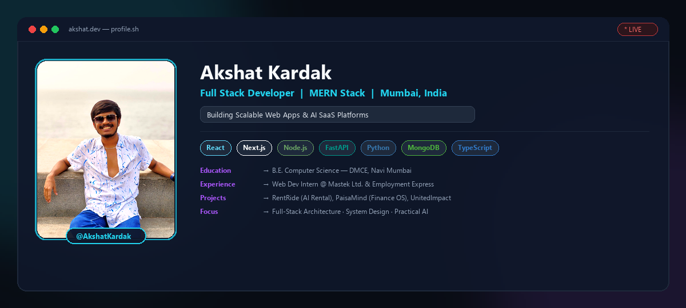
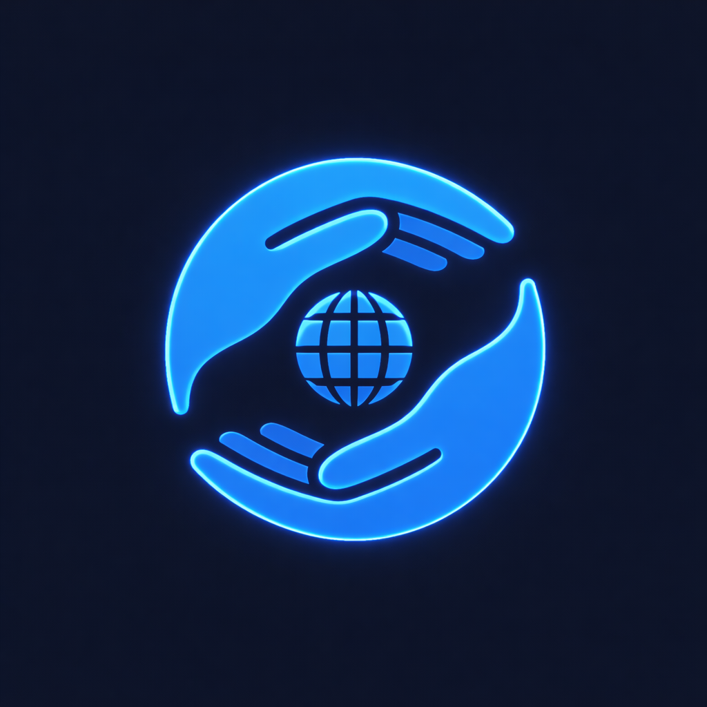
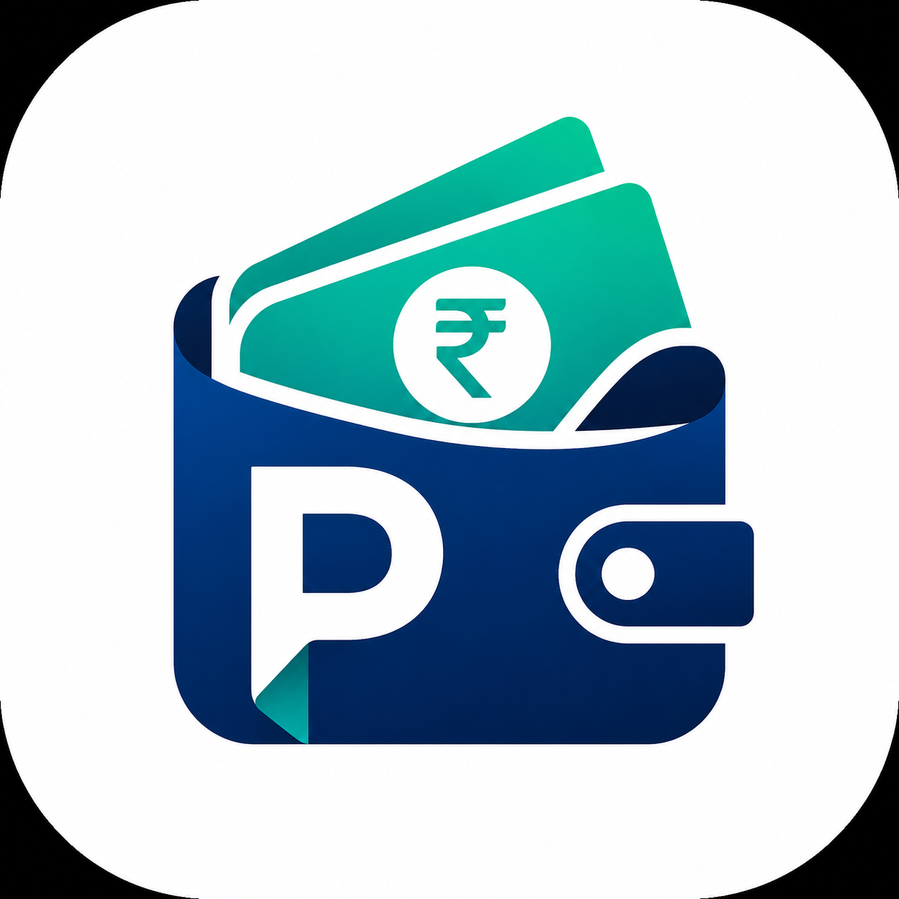
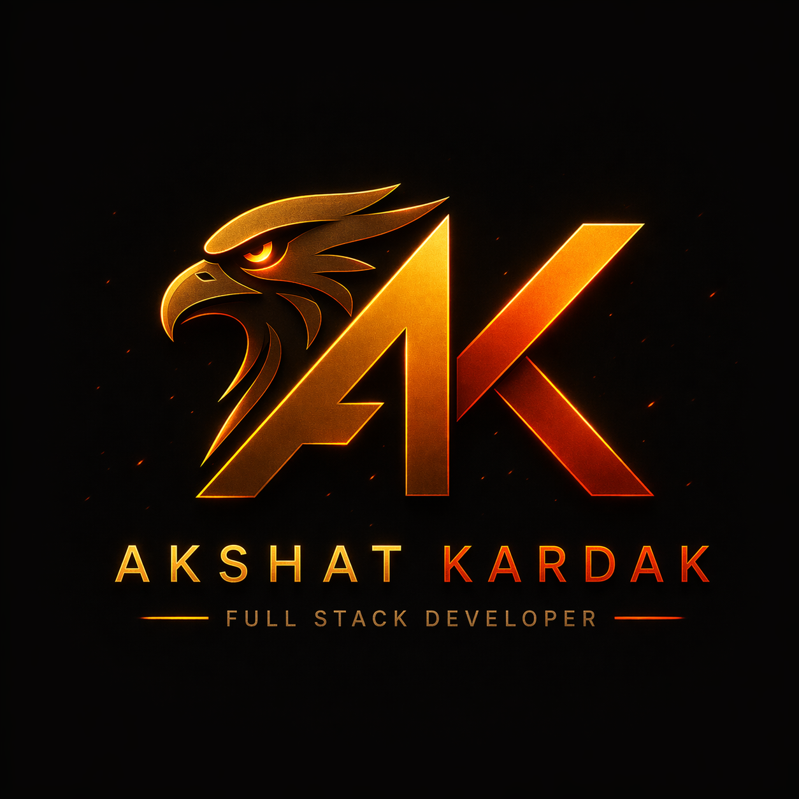

  

  

<!-- 🎬 PROFILE GIF 🎬 -->

  

<!-- ═══════════════════════════════════════════════════════════════════════════════════ -->

  
  
  
  
  
  

---

## About Me

Hi, I'm **Akshat Kardak**, a Computer Science Engineering student at **Datta Meghe College of Engineering, Navi Mumbai**, and a passionate **Full Stack Developer** who enjoys building scalable, user-centric web applications that solve real-world problems.

I specialize in developing complete end-to-end applications, from designing intuitive user interfaces to building secure backend services, REST APIs, databases, authentication systems, and AI-powered features. My primary focus is on creating products that are production-ready, maintainable, and capable of solving practical business challenges rather than simply demonstrating technical concepts.

Over the past few years, I've built several full-stack applications including **NagarWatch**, an enterprise-grade civic issue reporting and governance platform, **RentRide**, an AI-powered car rental platform, **PaisaMind**, an AI Finance OS designed for freelancers and small businesses, **UnitedImpact**, a digital platform connecting NGOs with donors, and multiple other web applications that integrate modern backend architecture with intelligent automation.

During my internship at **Mastek Ltd.**, I worked on enterprise-level AI solutions using **Next.js, FastAPI, TypeScript, Python, and REST APIs**, where I contributed to projects involving AI-powered document processing, QR & Barcode Inventory Management, Doppla SoundShield, and an ESP32-based Face Recognition Attendance System. This experience strengthened my understanding of scalable application architecture, backend optimization, asynchronous processing, API integrations, and enterprise software development practices.

Previously, as a **Web Development Intern at Employment Express Verband LLP**, I developed and maintained responsive corporate websites, implemented multi-currency support, optimized frontend performance, integrated analytics, and collaborated using Git and GitHub throughout the development lifecycle.

Beyond development, I enjoy learning **backend engineering, system design, authentication strategies, database optimization, cloud deployment, and practical AI integration**. I continuously improve my problem-solving abilities through **Data Structures & Algorithms**, contribute to personal projects, and actively participate in hackathons and collaborative software development.

**🚀 Currently Focused On**
- Building scalable full-stack applications with clean architecture
- Developing AI-powered SaaS and productivity platforms
- Exploring backend scalability, system design, and cloud deployment
- Strengthening Data Structures & Algorithms for software engineering roles
- Learning modern AI integration techniques for real-world applications
- Contributing to impactful open-source and collaborative projects

> **"I believe great software isn't just built with good code—it solves real problems, scales efficiently, and delivers an exceptional user experience."**

---

## Experience

<table>
  <tr>
    <td width="100%" valign="top">
      <h3>🏢 Web Development Intern</h3>
      <strong>Mastek Ltd.</strong> 
      <em>June 2026 – July 2026</em>
        
      
      
      
      
      
        
      <ul>
        <li>Developed enterprise-grade full-stack applications using <strong>Next.js, FastAPI, Python, and TypeScript</strong> for AI-powered business solutions</li>
        <li>Built responsive interfaces and integrated frontend components with secure backend APIs for seamless user experiences</li>
        <li>Designed scalable backend services featuring asynchronous processing, file uploads, automated PDF generation, and optimized API execution</li>
        <li>Contributed to <strong>Doppla SoundShield</strong>, an AI-powered music authenticity platform focused on copyright verification and voice clone detection</li>
        <li>Developed an <strong>ESP32 Face Recognition Attendance System</strong>, integrating IoT devices with AI-powered facial recognition for automated attendance management</li>
        <li>Worked on a <strong>QR & Barcode Inventory Management System</strong> for real-time asset tracking and inventory operations</li>
        <li>Collaborated within agile teams, participated in code reviews, and followed enterprise software development practices</li>
      </ul>
    </td>
  </tr>
  <tr>
    <td width="100%" valign="top">
      <h3>🏢 Web Development Intern</h3>
      <strong>Employment Express Verband LLP</strong> 
      <em>Aug 2025 – Oct 2025 · 3 months</em>
        
      
      
      
      
      
      
        
      <ul>
        <li>Built <strong>AnitechCS</strong> — a full-featured professional corporate website deployed on GitHub Pages with a 95+ Lighthouse score across all categories</li>
        <li>Implemented a <strong>multi-currency pricing system</strong> supporting 7 global currencies with static fallback rates and optional live API integration</li>
        <li>Developed an <strong>automated holiday discount system</strong> (15% off) with date-aware detection for Thanksgiving, Christmas & New Year periods</li>
        <li>Integrated <strong>Leaflet.js interactive maps</strong> with custom office markers, a smart chat widget with context-aware responses, and an expandable FAQ accordion</li>
        <li>Built a <strong>content management admin panel</strong> with keyboard shortcuts, live preview, JSON export/import backup, and testimonials manager</li>
        <li>Configured <strong>Google Analytics 4</strong> with custom event tracking for form submissions, currency changes, and user interactions</li>
        <li>Implemented a <strong>math captcha security system</strong> (no external dependencies), form validation, and full SEO setup with JSON-LD structured data</li>
      </ul>
       
      
      
    </td>
  </tr>
</table>

---

## 🚀 Featured Projects

<table>
  <tr>
    <td width="50%" valign="top" align="center">
      
        
      <strong>RentRide – AI Car Rental</strong>
        
      
Built a complete car rental platform enabling users to browse vehicles, make bookings, manage rentals, and complete secure online payments. Features <strong>Gemini AI chat assistant</strong>, JWT authentication with role-based access, admin dashboard, booking management, and an integrated Razorpay payment workflow.

      

        
        
        
        
        
      

      
      
    </td>
    <td width="50%" valign="top" align="center">
      
        
      <strong>RoastHub – AI Tweet Generator</strong>
        
      
Created an AI platform generating humorous, context-aware tweets using different tones, personalities, and writing styles with authentic Indian flavor — Bollywood refs, cricket banter & desi slang. Features custom prompt engineering, multiple roast modes, real-time AI generation, copy-to-clipboard, and conversation history. Powered by <strong>Groq API</strong>.

      

        
        
        
        
      

      
      
    </td>
  </tr>
  <tr>
    <td width="50%" valign="top" align="center">
      
        
      <strong>UnitedImpact – NGO & Donor Platform</strong>
        
      
Built a donation platform connecting NGOs with donors through transparent campaigns and secure online contributions. Features live campaign tracking, location-based NGO discovery, Razorpay integration, volunteer management, real-time geo-mapping, and an admin dashboard for campaign monitoring.

      

        
        
        
        
        
      

      
      
    </td>
    <td width="50%" valign="top" align="center">
      
        
      <strong>PaisaMind – AI Finance OS</strong>
        
      
Developed an AI-powered financial platform helping freelancers and small businesses manage expenses, invoices, taxes, cash flow, and overall financial planning from a single dashboard. Implements AI-driven financial insights, GST-ready invoice generation, automated email reminders, recurring payment tracking, and intelligent business analytics.

      

        
        
        
        
      

      
      
    </td>
  </tr>
  <tr>
    <td width="50%" valign="top" align="center">
      
        
      <strong>NagarWatch – Civic Issue & Governance Platform</strong>
        
      
Built an enterprise-grade, real-time civic issue reporting, tracking, and governance platform engineered specifically for Indian municipalities. Features 13+ Indian state languages with voice STT, geospatial duplicate prevention, sovereign India GIS map, CPWD contractor performance benchmarking, before/after photo proof audit lifecycle, and automated legal RTI petitions.

      

        
        
        
        
        
      

      
      
    </td>
    <td width="50%" valign="top" align="center">
      
        
      <strong>Developer Portfolio</strong>
        
      
Designed a modern portfolio showcasing projects, technical skills, experience, and achievements through an interactive and responsive interface. Features cinematic animations, smooth scrolling, project filtering, dark/light theme support, Three.js background, GSAP animations & Midnight Gold design system.

      

        
        
        
        
      

      
      
    </td>
  </tr>
</table>

---

## 🛠️ Tech Stack

### 🎨 Frontend

### ⚙️ Backend & Languages

### 🗄️ Databases & Cloud

### 🧰 Tools & DevOps

---

## 📊 GitHub Stats

---

## 📈 Contribution Graph

---

## 🤝 Let's Connect

I'm always open to <strong>internship opportunities</strong>, <strong>collaborations</strong>, and <strong>cool project ideas</strong>.

&nbsp;

&nbsp;

&nbsp;

 
Built with passion from Mumbai · Always learning, always shipping

